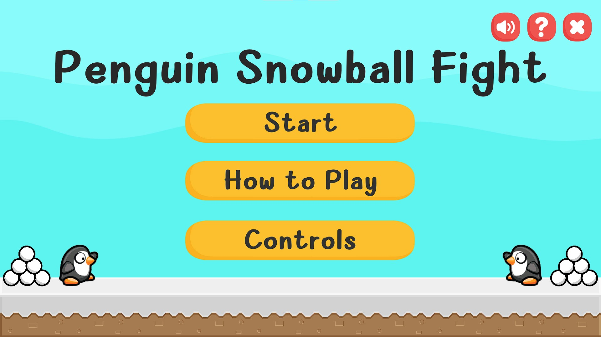
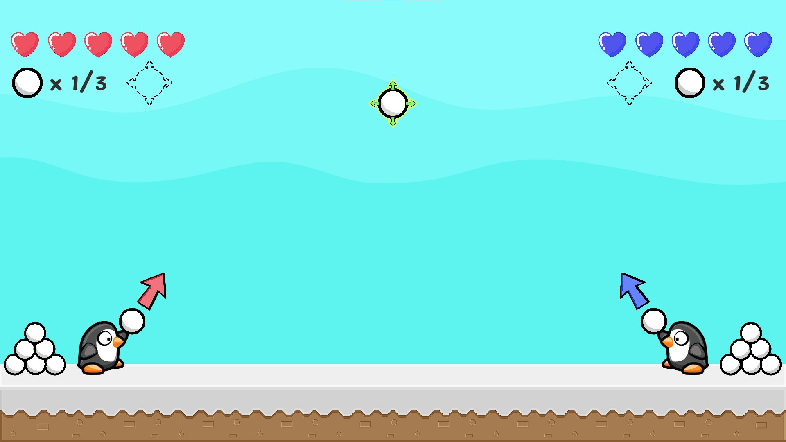
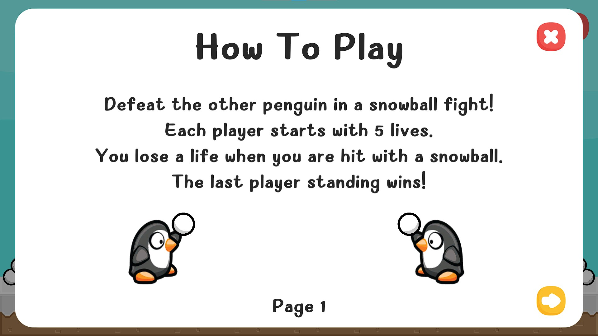
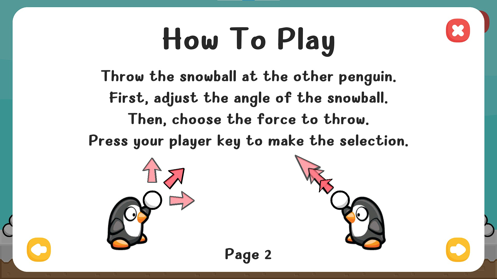
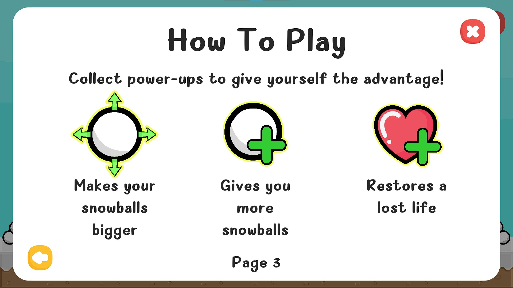

# bci-snowball

Penguin snowball fight game for BCI game jam 2021... developed by Jason (:

The game is designed to be accessible and can be played with a single button chosen by the user.
Bulit-in P300 control is also supported using LSL and can be toggled from the controls menu in game.

For latest builds for PC, please see the [Releases page](https://github.com/jason-leung/bci-snowball/releases).

## Game Screenshots

## How to Play

